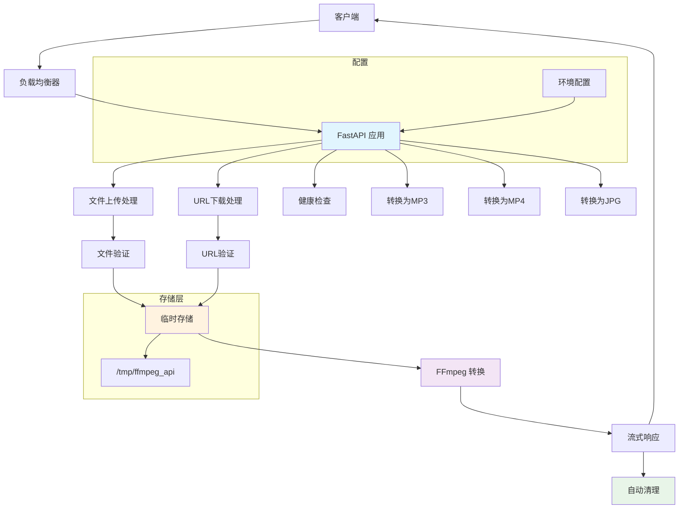

# FFmpeg Media 转换服务

[](https://python.org)
[](https://fastapi.tiangolo.com)
[](https://docker.com)

一个基于 FastAPI 和 FFmpeg 的多媒体转换微服务，支持将各种音频、视频和图像格式转换为 MP3、MP4 和 JPG 格式。

## 🚀 功能特性

- ✅ 支持文件上传转换
- ✅ 支持 URL 远程下载转换  
- ✅ 支持音频转 MP3（可自定义参数：码率、采样率、声道数）
- ✅ 支持视频转 MP4
- ✅ 支持图像转 JPG
- ✅ 流式响应，边转换边下载
- ✅ Docker 容器化部署
- ✅ 健康检查端点
- ✅ 自动临时文件清理

## 📋 系统要求

- Python 3.12+
- FFmpeg
- Docker (可选)

## 🛠️ 安装部署

### 方式一：Docker Compose（推荐）

```bash
# 克隆项目
git clone <repo-url>
cd ffmpeg-service

# 启动服务
docker-compose up -d

# 查看日志
docker-compose logs -f
```

服务将在 `http://localhost:9200` 启动。

**注意**: `docker-compose.yaml` 中配置了 `networks.proxy.external: true`，这意味着需要预先创建一个名为 `proxy` 的外部 Docker 网络。如果不需要此网络，可以编辑 `docker-compose.yaml` 文件将其移除。

### 方式二：直接运行

```bash
# 安装 FFmpeg
# Ubuntu/Debian: sudo apt install ffmpeg
# CentOS/RHEL: sudo yum install ffmpeg
# macOS: brew install ffmpeg

# 安装 Python 依赖
pip install -e .

# 启动服务
uvicorn app:app --host 0.0.0.0 --port 8000
```

## 📖 API 文档

### 根路径 (API 概览)

```http
GET /
```

访问根路径可获取 API 的基本介绍、版本、可用端点列表和简单的使用示例。

### 健康检查

```http
GET /health
```

**响应：**
```json
{"status": "ok"}
```

### 音频转 MP3

```http
POST /mp3
Content-Type: multipart/form-data
```

**参数：**

| 参数名 | 类型 | 必填 | 默认值 | 说明 |
|--------|------|------|--------|------|
| `file` | File | 否* | - | 上传的音频文件 |
| `url` | String | 否* | - | 远程音频文件URL |
| `bitrate` | String | 否 | "192k" | 音频码率 |
| `samplerate` | Integer | 否 | 44100 | 采样率 |
| `channels` | Integer | 否 | 2 | 声道数 |
| `filename` | String | 否 | "converted" | 输出文件名 |

**示例：**
```bash
# 上传文件转换
curl -X POST "http://localhost:9200/mp3" \
  -F "file=@input.wav" \
  -F "bitrate=320k" \
  -F "filename=my_audio" \
  -o output.mp3

# URL 下载转换
curl -X POST "http://localhost:9200/mp3" \
  -F "url=https://example.com/audio.wav" \
  -F "samplerate=48000" \
  -F "channels=1" \
  -o output.mp3
```

### 视频转 MP4

```http
POST /mp4
Content-Type: multipart/form-data
```

**参数：**

| 参数名 | 类型 | 必填 | 默认值 | 说明 |
|--------|------|------|--------|------|
| `file` | File | 否* | - | 上传的视频文件 |
| `url` | String | 否* | - | 远程视频文件URL |
| `filename` | String | 否 | "converted" | 输出文件名 |

**示例：**
```bash
# 上传文件转换
curl -X POST "http://localhost:9200/mp4" \
  -F "file=@input.avi" \
  -F "filename=my_video" \
  -o output.mp4

# URL 下载转换
curl -X POST "http://localhost:9200/mp4" \
  -F "url=https://example.com/video.avi" \
  -F "filename=downloaded_video" \
  -o output.mp4
```

### 图像转 JPG

```http
POST /jpg
Content-Type: multipart/form-data
```

**参数：**

| 参数名 | 类型 | 必填 | 默认值 | 说明 |
|--------|------|------|--------|------|
| `file` | File | 否* | - | 上传的图像文件 |
| `url` | String | 否* | - | 远程图像文件URL |
| `filename` | String | 否 | "converted" | 输出文件名 |

**示例：**
```bash
# 上传文件转换
curl -X POST "http://localhost:9200/jpg" \
  -F "file=@input.png" \
  -F "filename=my_image" \
  -o output.jpg

# URL 下载转换
curl -X POST "http://localhost:9200/jpg" \
  -F "url=https://example.com/image.png" \
  -F "filename=downloaded_image" \
  -o output.jpg
```

### Python 客户端示例

```python
import requests

# 音频转 MP3
with open('input.wav', 'rb') as f:
    response = requests.post(
        'http://localhost:9200/mp3',
        files={'file': f},
        data={
            'bitrate': '320k',
            'samplerate': 48000,
            'channels': 2,
            'filename': 'converted_audio'
        }
    )

with open('output.mp3', 'wb') as f:
    f.write(response.content)

# 视频转 MP4
with open('input.avi', 'rb') as f:
    response = requests.post(
        'http://localhost:9200/mp4',
        files={'file': f},
        data={'filename': 'converted_video'}
    )

with open('output.mp4', 'wb') as f:
    f.write(response.content)

# 图像转 JPG
with open('input.png', 'rb') as f:
    response = requests.post(
        'http://localhost:9200/jpg',
        files={'file': f},
        data={'filename': 'converted_image'}
    )

with open('output.jpg', 'wb') as f:
    f.write(response.content)

# URL 下载转换为 MP3
response = requests.post(
    'http://localhost:9200/mp3',
    data={
        'url': 'https://example.com/audio.wav',
        'bitrate': '256k'
    }
)

with open('output.mp3', 'wb') as f:
    f.write(response.content)
```

## 🏗️ 系统架构



## 🔧 配置说明

### Docker Compose 环境变量

在 `docker-compose.yaml` 中可以配置以下环境变量：

| 变量名 | 默认值 | 说明 |
|--------|--------|------|
| `TMP_DIR` | `/tmp/ffmpeg_api` | 临时文件存储目录 |

### 应用内限制

代码中定义了以下硬性限制：

| 限制项 | 值 |
|--------|-----|
| `MAX_FILE_SIZE` | `200MB` |
| `DOWNLOAD_TIMEOUT` | 连接超时 `10s`，读取超时 `60s` |
| `CHUNK_SIZE` | `1MB` (用于文件读写) |

### FFmpeg 参数

常用音频参数配置：

```bash
# 高质量 (320kbps)
bitrate=320k, samplerate=48000, channels=2

# 标准质量 (192kbps) 
bitrate=192k, samplerate=44100, channels=2

# 低质量 (128kbps)
bitrate=128k, samplerate=44100, channels=2

# 单声道
bitrate=128k, samplerate=44100, channels=1
```

## 🐛 故障排除

### 常见问题

1. **"ffmpeg failed" 错误**
   - 确保已安装 FFmpeg
   - 检查输入文件格式是否支持
   - 查看容器日志：`docker-compose logs`

2. **"文件过大" 错误 (413 Payload Too Large)**
   - 检查文件是否超过 200MB 限制
   - 考虑压缩文件或分段处理

3. **"下载失败" 错误 (400 Bad Request 或 408 Request Timeout)**
   - 验证 URL 是否有效且可访问
   - 检查网络连接
   - 确认远程服务器支持 HTTP/HTTPS
   - 注意下载超时时间为 60 秒

4. **容器启动失败**
   - 检查端口 9200 是否被占用
   - 确保有足够的磁盘空间
   - 查看 Docker 日志

### 日志查看

```bash
# Docker 日志
docker-compose logs -f ffmpeg-service

# 进入容器调试
docker-compose exec ffmpeg-service sh

# 检查 FFmpeg 安装
docker-compose exec ffmpeg-service ffmpeg -version
```

## 📊 性能监控

### 健康检查

服务提供健康检查端点，可用于监控：

```bash
# 检查服务状态
curl http://localhost:9200/health

# 预期响应
{"status": "ok"}
```

### 资源使用

- **内存**：约 50-100MB 基础内存，处理时额外 +文件大小
- **CPU**：转换时 CPU 密集，取决于文件大小和质量设置
- **磁盘**：临时文件约为输入文件的 2-3 倍大小
- **网络**：下载和上传速度取决于文件大小

## 🚦 已知限制

1. **文件大小限制**：单个文件最大 200MB
2. **并发处理**：服务本身无并发限制，高负载时可能影响性能，建议通过外部网关控制。
3. **格式支持**：依赖 FFmpeg 支持的格式
4. **存储**：临时文件存储在容器内的 `/tmp/ffmpeg_api` 目录（可通过 `TMP_DIR` 环境变量配置），`docker-compose.yaml` 中已挂载 `./data` 到此目录以实现数据持久化。
5. **安全性**：无认证机制，需要在网关层添加
6. **网络配置**：`docker-compose.yaml` 默认使用名为 `proxy` 的外部网络，如不需要请修改或删除。

## 🔮 未来改进

- [ ] 添加认证和授权机制
- [ ] 实现任务队列和异步处理
- [ ] 支持批量文件转换
- [ ] 添加转换进度跟踪
- [ ] 实现文件格式自动识别
- [ ] 支持更多输出格式
- [ ] 添加转换预设模板
- [ ] 实现分布式存储支持
- [ ] 添加速率限制和配额管理
- [ ] 集成监控和告警系统

## 📄 许可证

MIT License

## 🤝 贡献

欢迎提交 Issue 和 Pull Request！

## 📞 支持

如有问题，请通过以下方式联系：

- 提交 [Issue](../../issues)
- 发送邮件到项目维护者

---

**注意**：本项目仅用于学习和开发目的，生产环境使用前请进行充分的安全评估和性能测试。
